
>>>>>  gd2md-html alert:  ERRORs: 0; WARNINGs: 0; ALERTS: 26.

<ul style="color: red; font-weight: bold"><li>See top comment block for details on ERRORs and WARNINGs. <li>In the converted Markdown or HTML, search for inline alerts that start with >>>>>  gd2md-html alert:  for specific instances that need correction.</ul>

Links to alert messages:
<a href="#gdcalert1">alert1</a>
<a href="#gdcalert2">alert2</a>
<a href="#gdcalert3">alert3</a>
<a href="#gdcalert4">alert4</a>
<a href="#gdcalert5">alert5</a>
<a href="#gdcalert6">alert6</a>
<a href="#gdcalert7">alert7</a>
<a href="#gdcalert8">alert8</a>
<a href="#gdcalert9">alert9</a>
<a href="#gdcalert10">alert10</a>
<a href="#gdcalert11">alert11</a>
<a href="#gdcalert12">alert12</a>
<a href="#gdcalert13">alert13</a>
<a href="#gdcalert14">alert14</a>
<a href="#gdcalert15">alert15</a>
<a href="#gdcalert16">alert16</a>
<a href="#gdcalert17">alert17</a>
<a href="#gdcalert18">alert18</a>
<a href="#gdcalert19">alert19</a>
<a href="#gdcalert20">alert20</a>
<a href="#gdcalert21">alert21</a>
<a href="#gdcalert22">alert22</a>
<a href="#gdcalert23">alert23</a>
<a href="#gdcalert24">alert24</a>
<a href="#gdcalert25">alert25</a>
<a href="#gdcalert26">alert26</a>

>>>>> PLEASE check and correct alert issues and delete this message and the inline alerts.

**Expanding the Hunting Horizons using RIP manipulation for exposing devices**

**Introduction: **Drivers expose devices using IoCreateDevice + IoCreateSymbolicLink, However despite the presence of these APIs inside of a driver, it doesn't necessarily mean that they are bound to expose those drivers. There are many reasons why this might not work, It could be a registry read fail that acts as some sort of check or maybe the driver requires some other driver to be loaded and present for them to expose their device

**Observation: **We tested the drivers in bulk using our automated device enumeration python script and our driver collection script. In total, we found 8650 different unique drivers based on signatures (refer image 1). Of which we found 1226 drivers containing both of these API calls at once. We found 1536 drivers that were signed and also had either of the APIs in them. Over 509 drivers actually were loadable with just 63 drivers exposing any devices, 36 of which were test devices we accidently got drivers to expose through meeting up criteria, probably loading a prerequisite driver. The remaining devices had a lot of intersection as they were usually created by the same type of driver but of different versions but had similar if not exactly the same IOCTL function calls, making them duplicates for our hunting research. In total, we found 10 unique devices of the total 8650 unique drivers we had. That is just 0.115%, most of these drivers simply weren't signed however. There existed the intersection of drivers which had both of the API calls and drivers which were signed. Among which, most did not expose the devices despite having the conditions to do so. Our assumption is that they failed some pre-requisite check.  \
 \
Here is a clearer representation:

* **8650 **Unique Drivers
* **1226 **Contained both the API Calls
* **1536 **Signed **AND **contained either of the APIs
* **509 **Drivers loadable
* **63 **Drivers exposing devices
* **36 **were test devices
* **10 **unique devices
* **0.115% **of the devices had unique devices for testing

>>>>>  gd2md-html alert: inline image link here (to images/image1.png). Store image on your image server and adjust path/filename/extension if necessary.  (<a href="#">Back to top</a>)(<a href="#gdcalert2">Next alert</a>) >>>>> 

**Problem: **We clearly see the incredibly low yield of drivers that actually end up exposing their devices. To increase our yield rate, we are trying a new method to force these drivers to expose those hidden devices in the intersection section as described above. 

**Our methodology: **Since we can control the RIP pointer through our MSR R/W vuln (A post will be published on this if not done yet), we will attempt to utilize this primitive to point the RIP***** where we want it to be. 

***Note: **Since we are in kernel space, we cannot utilize ROP chaining due to SMEP protection stopping any user-mode space stack to be read from (which we control). More on this in a different post soon.

Since we are forced to only utilize ROP gadgets individually and no chaining is permitted, our kernel CE capabilities are significantly reduced. However, if we can expose these new drivers and test them out for vulnerabilities, we could find 0-days that allow for Kernel Write. Finally allowing us for greater kernel CE control.

Our approach consists of the following methods:

1. List every driver in the intersection 
2. Find the offset where the device execution is set to be via IoCreateDevice shortly probably followed by IoCreateSymbolicLink
3. Set the RIP in there using WinDBG for testing
4. Use WinOBJ to check for any new devices

This approach is theoretical so far and will need to be tested to see if this actually works or something like pre-conditions will block us, this is also hugely dependent upon the drivers code and automating this could be an issue however lets first try this manually to see if this even works to begin with.

** \
The first attempt: **So the first attempt is supposed to be simple, we found the function in Ghidra that has IoCreateDevice in it. 

>>>>>  gd2md-html alert: inline image link here (to images/image2.png). Store image on your image server and adjust path/filename/extension if necessary.  (<a href="#">Back to top</a>)(<a href="#gdcalert3">Next alert</a>) >>>>> 

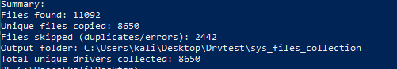

We then looked at the offset inside of Ghidra:

>>>>>  gd2md-html alert: inline image link here (to images/image3.png). Store image on your image server and adjust path/filename/extension if necessary.  (<a href="#">Back to top</a>)(<a href="#gdcalert4">Next alert</a>) >>>>> 

We found the real offset by using the RVA - VA to get 0x3395b. To get the base address of the driver, we utilized the lmDvm command to get the information for our driver. 

>>>>>  gd2md-html alert: inline image link here (to images/image4.png). Store image on your image server and adjust path/filename/extension if necessary.  (<a href="#">Back to top</a>)(<a href="#gdcalert5">Next alert</a>) >>>>> 

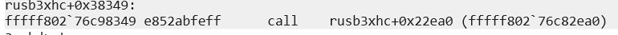

We confirmed if this was the right address by using the follow command and comparing the result with the Ghidra output:

>>>>>  gd2md-html alert: inline image link here (to images/image5.png). Store image on your image server and adjust path/filename/extension if necessary.  (<a href="#">Back to top</a>)(<a href="#gdcalert6">Next alert</a>) >>>>> 

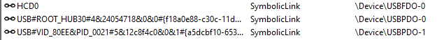

They matched. So we set the RIP to “fffff802`54e1395b” so it would call the function. We used the following command for that: \

>>>>>  gd2md-html alert: inline image link here (to images/image6.png). Store image on your image server and adjust path/filename/extension if necessary.  (<a href="#">Back to top</a>)(<a href="#gdcalert7">Next alert</a>) >>>>> 

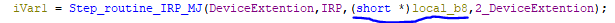
 \
 \
As you can see, this approach crashed our VM [Fatal System Error: 0x000000d1

                       (0xFFFFF80254E1395B,0x000000000000000D,0x0000000000000008,0xFFFFF80254E1395B)

]

This clearly was just the first attempt to see what would happen and as expected. Directly trying to execute this function when our register values weren't properly configured would lead to this. 0xD1 is the “DRIVER_IRQL_NOT_LESS_OR_EQUAL” Error and was caused due to bad register values. Lets try to observe what is actually happening behind the scenes. Lets put a breakpoint on IoCreateDevice to see what register values are passed in and whether we even reach that point or not. \
 \
We see the following function and where exactly the API call is present at: \

>>>>>  gd2md-html alert: inline image link here (to images/image7.png). Store image on your image server and adjust path/filename/extension if necessary.  (<a href="#">Back to top</a>)(<a href="#gdcalert8">Next alert</a>) >>>>> 

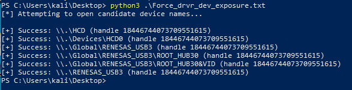
 \
 \
From Ghidra, we also discover the offset to be: 0x36a2eh. Lets set a breakpoint there and restart the driver: \

>>>>>  gd2md-html alert: inline image link here (to images/image8.png). Store image on your image server and adjust path/filename/extension if necessary.  (<a href="#">Back to top</a>)(<a href="#gdcalert9">Next alert</a>) >>>>> 

We see that the function is never called to begin with. Let's analyze the why:

 \
We see the following function that are called in a step routine for IRP_DISPATCH_TABLE:

>>>>>  gd2md-html alert: inline image link here (to images/image9.png). Store image on your image server and adjust path/filename/extension if necessary.  (<a href="#">Back to top</a>)(<a href="#gdcalert10">Next alert</a>) >>>>> 

Now we should confirm what param_1 + 0x30 actually points to, from WinDBG we find the following at the breakpoint:

>>>>>  gd2md-html alert: inline image link here (to images/image10.png). Store image on your image server and adjust path/filename/extension if necessary.  (<a href="#">Back to top</a>)(<a href="#gdcalert11">Next alert</a>) >>>>> 

R12 holds the param_1 value, lets dump the registers to see what param_1 actually is:

>>>>>  gd2md-html alert: inline image link here (to images/image11.png). Store image on your image server and adjust path/filename/extension if necessary.  (<a href="#">Back to top</a>)(<a href="#gdcalert12">Next alert</a>) >>>>> 

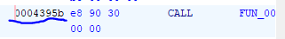

Let's look at the address and its offset by 30:

>>>>>  gd2md-html alert: inline image link here (to images/image12.png). Store image on your image server and adjust path/filename/extension if necessary.  (<a href="#">Back to top</a>)(<a href="#gdcalert13">Next alert</a>) >>>>> 

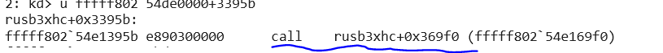

This does not particularly look like a dispatch table. Also we know “ffff8c87`e756f950” will be stored inside RAX and its +8 offset would be stored:

>>>>>  gd2md-html alert: inline image link here (to images/image13.png). Store image on your image server and adjust path/filename/extension if necessary.  (<a href="#">Back to top</a>)(<a href="#gdcalert14">Next alert</a>) >>>>> 

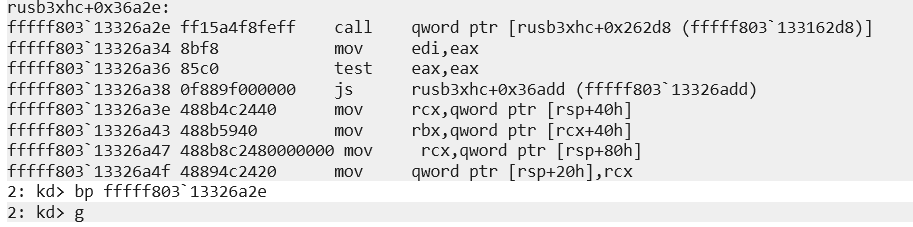

From the assembly code, we can see that the code simply stores the pointer of the Function “IRP_CreateDevice” into “ffff8c87`e756f958”

From here, we see the IRP_CreateDevice function. This could be an Induced Device Create routine. Therefore, we could attempt to use the CreateFileW API call to make this driver expose the device. The only problem is that we do not know what the device name is. Lets use static analysis in Ghidra to possibly find it hardcoded. 

>>>>>  gd2md-html alert: inline image link here (to images/image14.png). Store image on your image server and adjust path/filename/extension if necessary.  (<a href="#">Back to top</a>)(<a href="#gdcalert15">Next alert</a>) >>>>> 

 \
 \
Here we see references to “DosDevices” and “DosDevices\\HCD”, Interestingly enough, we see certain references to similar strings inside of WinObj: \

>>>>>  gd2md-html alert: inline image link here (to images/image15.png). Store image on your image server and adjust path/filename/extension if necessary.  (<a href="#">Back to top</a>)(<a href="#gdcalert16">Next alert</a>) >>>>> 

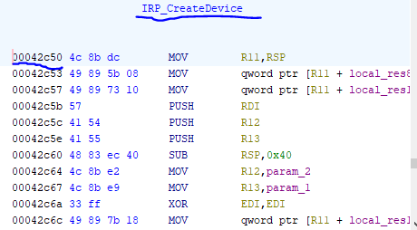

However these are not the devices created by the driver, more importantly, we see the mention of the string “RENESAS” inside of the driver. We see potential device names such as “RENESAS_USB3\\ROOT_HUB30&VID….” This indicates that the device name potentially starts with “Global\\RENESAS_USB3”. We also see “\\DosDevice\\HCD” \
 \
Let’s attempt to force the creation of the device using the CreateFileW API.

Before: \

>>>>>  gd2md-html alert: inline image link here (to images/image16.png). Store image on your image server and adjust path/filename/extension if necessary.  (<a href="#">Back to top</a>)(<a href="#gdcalert17">Next alert</a>) >>>>> 

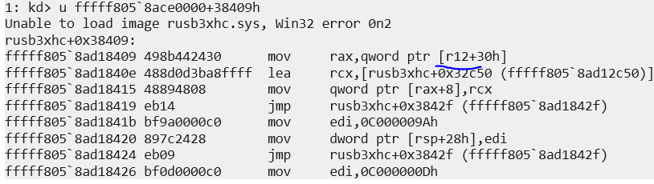
 \
After:

>>>>>  gd2md-html alert: inline image link here (to images/image17.png). Store image on your image server and adjust path/filename/extension if necessary.  (<a href="#">Back to top</a>)(<a href="#gdcalert18">Next alert</a>) >>>>> 

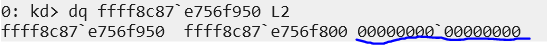
 \
 \
Not a success. Let's analyze why this might be the case, from the code section, we can see there is a conditional if statement that if satisfied will trigger the section where the IRP_CreateDevice function lives: \

>>>>>  gd2md-html alert: inline image link here (to images/image18.png). Store image on your image server and adjust path/filename/extension if necessary.  (<a href="#">Back to top</a>)(<a href="#gdcalert19">Next alert</a>) >>>>> 

 \
From the looks of it, it seems to be looking for a magic value inside of param_3. It wants param three to start with the following: “0x94 0x03 0x00”. Lets see what param_3 actually even is

>>>>>  gd2md-html alert: inline image link here (to images/image19.png). Store image on your image server and adjust path/filename/extension if necessary.  (<a href="#">Back to top</a>)(<a href="#gdcalert20">Next alert</a>) >>>>> 

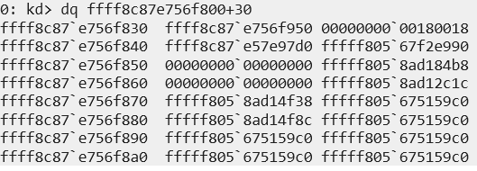

>>>>>  gd2md-html alert: inline image link here (to images/image20.png). Store image on your image server and adjust path/filename/extension if necessary.  (<a href="#">Back to top</a>)(<a href="#gdcalert21">Next alert</a>) >>>>> 

We can see that param_3 is locally initialized and is not under the control of the user. We also see that local_b8 has its “magic numbers” hardcoded in there therefore, the actual if statement is not really a barrier, we can confirm this by putting a breakpoint at the if statement to see what it is actually doing at runtime. 

Lets use “sxe ld:rusb3xhc” to set the breakpoint at when our driver loads, we can then use “lmDvm rusb3xhc” to find its base address and then set the breakpoint to the where we want it to go. For our case, it will be at “fffff802`76c9830d”. The breakpoint hit, so let's see what's going on now.

From here we see that inside WinDBG, we successfully hit: \

>>>>>  gd2md-html alert: inline image link here (to images/image21.png). Store image on your image server and adjust path/filename/extension if necessary.  (<a href="#">Back to top</a>)(<a href="#gdcalert22">Next alert</a>) >>>>> 

Which corresponds to 

>>>>>  gd2md-html alert: inline image link here (to images/image22.png). Store image on your image server and adjust path/filename/extension if necessary.  (<a href="#">Back to top</a>)(<a href="#gdcalert23">Next alert</a>) >>>>> 

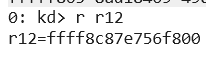

Therefore we can be certain that our param_3 aka the local_b8 does pass this test. In fact after setting a breakpoint at the exact line where IRP_CreateDevice is being initialized aka “*(code **)(*(longlong *)(param_1 + 0x30) + 8) = IRP_CreateDevice;”, we still see the breakpoint being hit. Therefore we can confirm that the magic values are not the issues but instead it might be our approach to having the driver expose the devices. From the code we know that the function that exposes the devices aka IRP_CreateDevice is being hooked to the Dispatch Table pointer of IRP_MJ_CREATE which is automatically triggered by windows if we pass on a correct request with CreateFileW. We can see if we can trigger the function by setting a breakpoint at that offset. 

>>>>>  gd2md-html alert: inline image link here (to images/image23.png). Store image on your image server and adjust path/filename/extension if necessary.  (<a href="#">Back to top</a>)(<a href="#gdcalert24">Next alert</a>) >>>>> 

We know the actual offset = RVA - VA → 0x32c50

Therefore, let’s setup a breakpoint at:

>>>>>  gd2md-html alert: inline image link here (to images/image24.png). Store image on your image server and adjust path/filename/extension if necessary.  (<a href="#">Back to top</a>)(<a href="#gdcalert25">Next alert</a>) >>>>> 

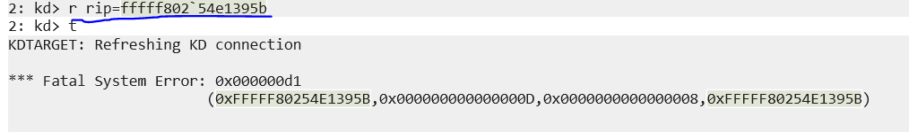

and run our python script using CreateFileW to possibly call IRP_MJ_CREATE:

>>>>>  gd2md-html alert: inline image link here (to images/image25.png). Store image on your image server and adjust path/filename/extension if necessary.  (<a href="#">Back to top</a>)(<a href="#gdcalert26">Next alert</a>) >>>>> 

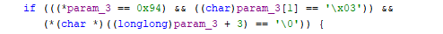

However we see no breakpoint being hit. Therefore we can assume this function is not getting called through this approach. \
 \
Lets see why that is: \

>>>>>  gd2md-html alert: inline image link here (to images/image26.png). Store image on your image server and adjust path/filename/extension if necessary.  (<a href="#">Back to top</a>)(<a href="#gdcalert27">Next alert</a>) >>>>> 

 \
We see there are only two instances of IoCreateSymbolicLink being present, one of them being inside of the IRP_DeviceCreate Function, therefore it does not expose the devices to user-mode. It's like a chicken and egg situation, where to get the symbolicLink, we will need to call the IRP_MJ_CREATE function which requires the device to be exposed to usermode using IoCreateSymbolicLink.

Therefore to cause the driver to expose the device we need something in the kernel using the CreateFileW API to get IRP_MJ_CREATE to expose. This is probably done through a helper driver. Considering we have RIP control. We could force execution of the code however we require the proper register values that we are unable to dump right now.

**Conclusion: **RIP Manipulation can allow us to execute code that's usually hidden barriers like kernel callable only IRP_MJ_CREATE which could allow for user-mode access to the IOCTL codes however that requires careful manipulation of the registers so that they store the appropriate values. While this could allow for forcing drivers to expose devices. The success rate and even the methodology really depends upon the driver itself. 

**Future work: **Whilst the particular case of **RUSB3XHC.sys **didn’t allow us to get the value of the registers required for a successful call to the function “IRP_CreateDevice”. Potentially looking at other drivers would allow us to provide a simple PoC.

**Security Disclosure: **All the work was performed inside an isolated lab environment and on systems we control. Please ensure that you follow proper security etiquette whilst performing such research.

Thank you for the read :DDDDDDDDDD
